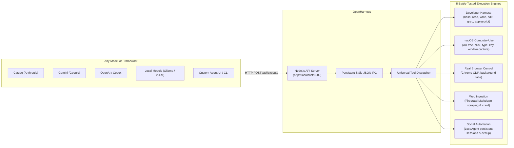

<div align="center">

# OpenHarness ⌘
### By [OpenAgent](https://github.com/GitCoder052023/OpenAgent)

**Bring your own brain.**<br/>
Claude, Gemini, Codex, or a local Ollama model. Give your agent hands on your Mac.
OpenHarness connects it to 55+ tools for code, native apps, Chrome, the web, and social accounts.

[](https://apple.com)
[](https://nodejs.org/)
[](https://bun.sh)
[](https://www.python.org/)
[](https://astral.sh/uv)
[](https://skills.sh/GitCoder052023/OpenHarness)
[]()
[](LICENSE)
[](https://github.com/GitCoder052023/OpenAgent)

[Quick Start](#quick-start-60-seconds) · [Why OpenHarness](#why-openharness) · [How It Works](#how-it-works) · [Engines & Tools](#core-engines--tools) · [Agent Skill](#installable-agent-skill) · [Connect AI Agents (MCP)](#use-openharness-with-ai-agents-mcp) · [Local API Server](#local-api-server-direct-http-access) · [Documentation](#documentation)

</div>

---

OpenHarness is the execution engine under [OpenAgent](https://github.com/GitCoder052023/OpenAgent), available on its own. Connect your model through MCP or HTTP; it chooses the tools, and OpenHarness runs them on your Mac.

Your model does the thinking. Your machine does the work.

### From chat to your Mac

An example session in an MCP client such as Claude Desktop or Cursor, with the API server running:

```text
You:       "Run the tests in this repo. If one fails, read the failing test
            and open it in my editor. Show me the editor window."

Agent:      bash          pnpm test                 one test fails
            read          failing test file         inspect the assertion
            bash          open the file in editor   file on your Mac
            mac_see       editor window             screenshot returned

Agent:     "Here's the failing assertion, and the file is open in your editor."

You:       "Suggest a fix first. Don't change anything yet."
```

This is an illustrative workflow, not a recorded test run. The agent decides what to call and how to present the results; OpenHarness handles local execution.

<div align="center">
  <strong>You bring the brain. OpenHarness brings the hands.</strong>
</div>

---

## Quick Start (60 Seconds)

1. **Clone & install**:
   ```bash
   git clone https://github.com/GitCoder052023/OpenHarness.git
   cd OpenHarness
   pnpm install && ./install.py
   ```
2. **Start the OpenHarness API Server** (in a dedicated terminal):
   ```bash
   pnpm run server
   ```
3. **Configure your AI client**: Add the `openharness` server block to your client's MCP configuration file (see [MCP Client Configuration](#mcp-client-configuration) below).
4. **Reload your AI client**: Restart Claude Desktop, Cursor, or your agent.
5. **Ask a harmless test question**:
   > *"Use OpenHarness to report my machine's system information."*
6. **Verify the result**: Your agent calls `openharness_execute` and reports real local system data.

---

## Why OpenHarness

A model can explain a failing test. Getting it to run that test on your Mac, read the file, and inspect the app is a different problem.

OpenAgent already had the tools for that. But using them with another model meant bringing along its WhatsApp transport, microphone loop, wake-word detection, and speech models too.

OpenHarness separates the execution engine from the assistant. Keep the 55+ tools and five engines; leave the voice and messaging setup behind. Use an MCP client, call the HTTP API from your own app, or connect a local model through your agent framework. There is no built-in LLM loop and no required model provider.

### The Core Problem: Reasoning vs. Execution

Modern AI models are exceptionally good at reasoning, planning, and coding, but they lack a standardized bridge to actually interact with your computer:

```text
Without OpenHarness                      With OpenHarness
┌──────────────────┐                     ┌──────────────────┐
│     AI Agent     │                     │     AI Agent     │
└────────┬─────────┘                     └────────┬─────────┘
         │                                        │
         │ Can reason                             │ MCP (stdio)
         ▼                                        ▼
┌──────────────────┐                     ┌──────────────────┐
│ Limited ability  │                     │   OpenHarness    │
│ to touch machine │                     └────────┬─────────┘
└──────────────────┘                              │ Standardized
                                                  ▼ local execution
                                         ┌──────────────────┐
                                         │ 55+ macOS, Web,  │
                                         │ Shell & UI Tools │
                                         └──────────────────┘
```

OpenHarness does not decide what to do next. Your agent owns the plan, permissions, and conversation; OpenHarness supplies the tools.

### Skill, MCP, API, and Worker

OpenHarness provides distinct interfaces depending on what is connecting to it:

| Layer | Role | Who Connects To It |
|---|---|---|
| **Agent Skill** | Teaches the AI agent *how and when* to choose OpenHarness capabilities | Agent prompts, LLMs, `.agents/skills` |
| **MCP Connector** | Standardized protocol bridge (`stdio`) exposing tools to MCP clients | Claude Desktop, Cursor, Zed, Goose |
| **HTTP API Server** | Canonical execution boundary (`REST/JSON`) on `http://127.0.0.1:8080` | MCP connector, scripts, remote backends |
| **Worker Process** | Persistent Python runtime keeping adapters and tool libraries warm in memory | API Server (stdio JSON IPC) |

The **Agent Skill** provides the knowledge (teaching your agent what tools exist and what parameters they expect), while the **MCP Connector** provides the runtime bridge (allowing your agent to execute those tools directly on the machine).

---

## How It Works



---

## Core Engines & Tools

OpenHarness gives your AI agent direct access to **55+ tools** across 5 specialized engines:

| Engine | Capabilities | Key Tools |
| :--- | :--- | :--- |
| **Developer Harness** | Sandboxed `bash`, paginated `read`, atomic `write`, exact-match `edit` with unified diffs, `ripgrep` search, `glob`, native `applescript`, system info | `bash`, `read`, `write`, `edit`, `grep`, `glob`, `applescript`, `system_info` |
| **Native macOS Computer-Use** | Window screenshot inspection, Accessibility tree queries, PID-targeted clicks, keystrokes, drag-and-drop, directional scrolls that don't steal focus | `mac_see`, `mac_click`, `mac_type`, `mac_key`, `mac_drag`, `mac_scroll`, `mac_apps`, `mac_windows`, `mac_ax`, `mac_python` |
| **Real Browser Control** | Authenticated Chrome control via CDP: background tabs, compositor clicks through iframes and shadow DOM, framework-safe form filling | `browser_open`, `browser_info`, `browser_click`, `browser_fill`, `browser_type`, `browser_key`, `browser_scroll`, `browser_tabs`, `browser_see`, `browser_eval` |
| **Web Ingestion & Scraping** | Scrape dynamic web pages directly into clean LLM Markdown, full web search, recursive domain crawling, sitemaps, JSON schema extraction | `firecrawl_scrape`, `firecrawl_search`, `firecrawl_crawl`, `firecrawl_status`, `firecrawl_map`, `firecrawl_extract`, `firecrawl_doctor` |
| **Social Media Automation** | Persistent Chrome sessions on Threads, Reddit, X, LinkedIn, Instagram, YouTube, TikTok: publishing, anti-deduplication checks, replies, screenshot verification | `social_targets`, `social_setup`, `social_post`, `social_reply`, `social_like`, `social_search`, `social_screenshot`, `social_dedup_check`, `social_agent_task` |

---

## Installable Agent Skill

OpenHarness includes an **Agent Skill** that teaches your agent which tools to use and what arguments they expect.

### Installation

Install the skill into your project or agent environment using the standard Skills CLI:

```bash
npx skills add GitCoder052023/OpenHarness
```

Or install the specific `openharness` skill explicitly:

```bash
npx skills add GitCoder052023/OpenHarness --skill openharness
```

To install globally across all configured agents:

```bash
npx skills add GitCoder052023/OpenHarness -g
```

---

## Use OpenHarness with AI Agents (MCP)

The **Model Context Protocol (MCP)** lets your existing AI client call OpenHarness tools without a custom integration.

With OpenHarness connected via MCP, an AI agent running in **Claude Desktop, Cursor, Zed, Goose, or custom agent frameworks** can execute local developer tools, inspect your macOS desktop, control authenticated Chrome, crawl web pages, and automate repetitive workflows.

```text
┌────────────────────────┐
│        AI Agent        │
│ Claude / Cursor / etc. │
└───────────┬────────────┘
            │
           MCP (stdio JSON-RPC)
            │
            ▼
┌────────────────────────┐
│ OpenHarness MCP Bridge │
│       (src/mcp)        │
└───────────┬────────────┘
            │
         HTTP JSON (POST /api/execute)
            │
            ▼
┌────────────────────────┐
│ OpenHarness API Server │
│      (src/server)      │
└───────────┬────────────┘
            │
          Worker (stdio JSON IPC)
            │
            ▼
┌────────────────────────┐
│    Local Execution     │
│ 55+ Tools & 5 Engines  │
└────────────────────────┘
```

The MCP connector acts strictly as a **protocol adapter**. It receives standardized MCP tool calls over `stdio`, sends them to the local OpenHarness API server over HTTP, and formats the execution results for the model.

---

### Installation & Prerequisites

OpenHarness requires:
- **macOS** (Apple Silicon or Intel, macOS 13 Ventura or newer recommended)
- **Node.js 18+** & **pnpm**
- **Python 3.11+** & **uv** (installed automatically if missing by `install.py`)

Run the automated installer:

```bash
# 1. Clone the repository
git clone https://github.com/GitCoder052023/OpenHarness.git
cd OpenHarness

# 2. Install Node.js packages
pnpm install

# 3. Bootstrap the Python virtual environment and dependencies
./install.py
# (or: python3 install.py)
```

The installer synchronizes the Python virtual environment (`.venv`), installs CLI modules, generates `.env` defaults, and pre-audits macOS Accessibility permissions.

---

### The Two Processes: Server & Connector

Using OpenHarness with an MCP-enabled agent involves two cooperating processes:

```text
Terminal 1 (Host Background Service)
┌─────────────────────────────────┐
│ OpenHarness API Server          │
│ • Maintains warm Python worker  │
│ • Listens on 127.0.0.1:8080     │
└─────────────────────────────────┘
                ▲
                │ HTTP POST /api/execute
                ▼
AI Client Host (Claude Desktop, Cursor, IDE)
┌─────────────────────────────────┐
│ OpenHarness MCP Connector       │
│ • Launched by AI Client (stdio) │
│ • Translates MCP ↔ HTTP JSON    │
└─────────────────────────────────┘
```

1. **Process 1: OpenHarness API Server (`src/server`)**
   The execution boundary. It maintains a warm Python worker with adapters loaded in memory.
   ```bash
   pnpm run server
   # or: pnpm start
   ```
   Keep this running in a terminal or background service while using OpenHarness.

2. **Process 2: OpenHarness MCP Connector (`src/mcp`)**
   The protocol bridge. Your AI client launches this process automatically over `stdio` based on your MCP configuration. It does **not** manage or spawn the API server - it assumes the API server is already running on `http://127.0.0.1:8080`.

---

### MCP Client Configuration

Add OpenHarness to your MCP client's configuration file (e.g. `claude_desktop_config.json` for Claude Desktop, or your IDE's MCP settings):

```json
{
  "mcpServers": {
    "openharness": {
      "command": "pnpm",
      "args": ["mcp"],
      "env": {
        "OPENHARNESS_API_URL": "http://127.0.0.1:8080"
      }
    }
  }
}
```

#### Configuration Notes
- **Working Directory (`cwd`)**: If your MCP client supports specifying a working directory, set it to the root of your cloned `OpenHarness` repository so `pnpm` finds `package.json`.
- **Absolute Paths**: If your client does not inherit your user shell's `PATH`, use the full path to `pnpm` (e.g. `/opt/homebrew/bin/pnpm` on Apple Silicon or `/usr/local/bin/pnpm` on Intel).
- **Direct Script Alternative**: If your client does not support setting a working directory for `pnpm`, launch the connector script directly:
  ```json
  {
    "mcpServers": {
      "openharness": {
        "command": "npx",
        "args": ["-y", "tsx", "/Users/yourname/OpenHarness/src/mcp/index.ts"],
        "env": {
          "OPENHARNESS_API_URL": "http://127.0.0.1:8080"
        }
      }
    }
  }
  ```

---

### The MCP Tool: `openharness_execute`

The connector exposes a single, unified execution tool:

#### `openharness_execute`

> **Purpose**: The main bridge between the AI agent and OpenHarness. It allows the agent to request execution of any supported OpenHarness capability on the local machine.

**Input Schema**:
- `tool` (*string*, required): Name of the OpenHarness capability to execute (e.g. `system_info`, `bash`, `read`, `write`, `edit`, `grep`, `browser_open`, `mac_see`).
- `args` (*object*, optional): Key-value arguments dictionary for the tool.

**Example Tool Payload**:
```json
{
  "tool": "bash",
  "args": {
    "command": "uname -a"
  }
}
```

---

### What the User Experiences

With an MCP client connected, a request becomes a local tool call:

```text
User:
"Check my local machine's system information and available disk space."

AI Agent:
1. Understands the intent and selects OpenHarness.
2. Formulates and dispatches tool call:
   openharness_execute(tool="system_info", args={})
3. The MCP connector sends HTTP POST to the local OpenHarness API server.
4. OpenHarness executes the tool and returns structured hardware and OS data.
5. The agent synthesizes a clear response:
   "You are running macOS 14.5 (Darwin 23.5.0) on an Apple M3 Max with
    36 GB memory and 482 GB available disk space."
```

---

### What OpenHarness Can Actually Do

OpenHarness exposes **55+ specialized tools** across 5 execution engines:

1. **Developer & Shell Automation**:
   - `system_info`: Inspect OS, CPU, memory, uptime, battery, and platform details.
   - `bash`: Sandboxed shell command execution with timeouts and output capture.
   - `read`: Paginated file reader with line range slicing and byte limits.
   - `write`: Atomic file creation and writing.
   - `edit`: Exact-match file block replacement with unified diffs.
   - `grep` & `glob`: Fast codebase search via ripgrep and file pattern matching.
   - `applescript`: Execute native macOS AppleScript and JXA automation scripts.

2. **Native macOS Desktop Computer-Use**:
   - `mac_see`: Take and inspect window screenshots.
   - `mac_ax`: Query macOS Accessibility (AX) tree for UI elements.
   - `mac_click`, `mac_type`, `mac_key`: Send clicks, keystrokes, and text to specific applications.
   - `mac_drag`, `mac_scroll`: Mouse gestures that interact without stealing window focus.
   - `mac_apps`, `mac_windows`: Enumerate running processes and visible windows.

3. **Real Chrome Browser Control**:
   - `browser_open`, `browser_tabs`: Launch and manage authenticated Chrome tabs.
   - `browser_click`, `browser_fill`, `browser_type`: Compositor-level interaction with DOM, shadow DOM, and iframes.
   - `browser_see`, `browser_eval`: Take browser viewport screenshots and execute JavaScript in page context.

4. **Web Ingestion & Scraping**:
   - `firecrawl_scrape`, `firecrawl_search`: Scrape dynamic web pages into clean LLM-friendly Markdown.
   - `firecrawl_crawl`, `firecrawl_map`: Crawl domains and extract sitemaps.

5. **Social Media Automation**:
   - `social_post`, `social_reply`, `social_like`: Manage authenticated Chrome sessions on Threads, Reddit, X, LinkedIn, and Instagram.

---

### Tool Selection & Expected Behavior

- **How the Agent Decides**: The AI agent analyzes your prompt and decides which OpenHarness tool best satisfies the request (e.g. using `read` to view a file, `grep` to find code, or `mac_see` to look at an open window).
- **Graceful Error Handling**: If the agent asks for an unsupported or misspelled tool name, OpenHarness returns a clear error:
  `Tool 'foo' execution failed: Unknown harness tool: 'foo'`
  The MCP connector surfaces this error with `isError: true`. The agent receives the error description and can self-correct without crashing.

---

### Verify the Installation

To verify that your setup is working from end to end:

1. **Ensure the API server is running**:
   ```bash
   pnpm run server
   ```
2. **Verify API server health** in another terminal:
   ```bash
   curl http://127.0.0.1:8080/health
   ```
   Expected response:
   ```json
   {"status":"ok","worker":"ready"}
   ```
3. **Ask your AI agent a harmless test request**:
   > *"Use OpenHarness to report my current macOS version and CPU architecture."*
4. **Observe the execution**:
   - In Terminal 1, you will see the API server log the incoming request:
     `[INFO] POST /api/execute`
   - Your AI agent will reply with your actual macOS version and CPU details.

---

### Troubleshooting

#### 1. MCP Server Does Not Start in AI Client
- **Check Node.js version**: Ensure you are running Node.js 18 or newer (`node -v`).
- **Check pnpm**: Verify `pnpm` is installed and accessible in your system PATH (`which pnpm`). If not, configure the absolute path in your MCP client JSON (e.g. `/opt/homebrew/bin/pnpm`).
- **Check dependencies**: Ensure `pnpm install` ran successfully in the OpenHarness directory.

#### 2. MCP Server Connects, But Tool Calls Fail
- **Is the API server running?** Check Terminal 1. The MCP connector cannot execute tools without the API server. Start it with `pnpm run server`.
- **Check API URL**: By default the connector expects `http://127.0.0.1:8080`. If you changed the port via `OPENHARNESS_PORT`, set `OPENHARNESS_API_URL` to match in your MCP configuration.
- **Worker readiness**: If `curl http://127.0.0.1:8080/health` reports `"worker":"unavailable"`, check that Python dependencies were installed properly with `./install.py`.

#### 3. AI Client Cannot Connect to Server
- **Check MCP configuration JSON**: Ensure JSON syntax is valid (no trailing commas).
- **Check working directory**: Verify that your MCP client configuration specifies the correct repository directory, or use the direct `tsx` script path.

#### 4. macOS Permissions Prompt for Desktop Tools
- When using `mac_see`, `mac_click`, or `mac_ax`, macOS will prompt for **Accessibility** and **Screen Recording** permissions in **System Settings > Privacy & Security**. Grant permissions to your terminal, Python, or AI host app. Run `./install.py` to re-audit permissions anytime.

---

### Security & Safe Operation

> [!WARNING]
> **Security Notice**: OpenHarness runs locally and provides access to powerful computer capabilities (shell commands, file modification, browser control, native macOS automation).
>
> - **Trusted AI Clients Only**: Only connect AI clients and models that you trust. Treat the MCP connection as an administrative local automation interface.
> - **Supervise Sensitive Operations**: While developer tools operate within normal macOS user permissions, review destructive shell commands or file operations before approving them.
> - **Localhost vs. LAN Binding**:
>   - By default, the API server binds to `0.0.0.0:8080`, allowing trusted devices on your private local network (LAN) to access OpenHarness.
>   - To restrict access strictly to the local machine, set:
>     ```bash
>     export OPENHARNESS_HOST=127.0.0.1
>     ```
> - **Never Expose to the Public Internet**: Do not forward port 8080 on your router, bind to a public IP, or expose OpenHarness through unauthenticated tunnels (e.g. ngrok, Cloudflare Tunnel).

---

## Local API Server (Direct HTTP Access)

OpenHarness provides a lightweight Node.js + TypeScript + Express HTTP server located under `./src/server`. It exposes local machine execution capabilities over HTTP for autonomous agents, external scripts, and local network clients.

The server functions strictly as an **execution transport layer**. A client submits a tool name and arguments via HTTP JSON. The server forwards the payload across a persistent stdio IPC connection to the underlying OpenHarness worker, executes the requested tool, and returns the result back to the client.

The API server does not perform model inference, agent orchestration, prompt expansion, or tool translation. It is an unopinionated bridge between HTTP and OpenHarness execution.

### Architecture

```text
Client
  │
  │ HTTP JSON (POST /api/execute)
  ▼
OpenHarness API Server (Node.js / Express)
  │
  │ Stdio JSON IPC (Request ID correlated)
  ▼
OpenHarness Worker (Persistent Python Process)
  │
  ▼
OpenHarness Execution Layer (Dispatcher)
  │
  ▼
Harness Engines (Developer, macOS, Browser, Web, Social)
  │
  ▼
Execution Result
  │
  └───────────────────────────────► Client (HTTP JSON Response)
```

The Node.js server maintains a single, persistent Python worker process (`python -m openharness.worker`) across requests, avoiding process initialization overhead and keeping adapters warm in memory.

### Starting the Server

Start the API server using pnpm:

```bash
# Production / standard mode
pnpm run server
# or
pnpm start

# Development mode (with file watcher)
pnpm run dev
```

During startup, the server boots the persistent Python worker, confirms readiness, and binds to the configured network interface:

```text
[INFO] Starting Python worker using /Users/hamdan/OpenHarness/.venv/bin/python...
[INFO] Python worker is ready
[INFO] OpenHarness API listening on http://0.0.0.0:8080
```

### Configuration

Server settings are configured via environment variables:

| Variable | Default | Description |
|---|---|---|
| `OPENHARNESS_HOST` | `0.0.0.0` | Network interface to bind (`0.0.0.0` for LAN access, `127.0.0.1` for localhost only) |
| `OPENHARNESS_PORT` | `8080` | Port number to listen on |
| `OPENHARNESS_TIMEOUT_MS` | `120000` | Transport request timeout in milliseconds (default: 2 minutes) |
| `OPENHARNESS_PYTHON` | Auto | Path to Python interpreter (defaults to `.venv/bin/python` or `python3`) |

### Network Topology & LAN Access

By default, the server binds to `0.0.0.0:8080`, allowing trusted devices on your local area network (LAN) to access OpenHarness:

```text
Host Machine (Mac running OpenHarness)
       │
       │ Wi-Fi / Ethernet LAN (0.0.0.0:8080)
       ▼
 ┌───────────────┬───────────────┬─────────────────────────┐
 │               │               │                         │
Laptop         Phone       AI Agent / Client        Dev Machine
```

Clients on the same local network can target the host machine's local IP address:
```
http://<your-host-lan-ip>:8080/api/execute
```

To restrict access exclusively to the local host machine, set `OPENHARNESS_HOST=127.0.0.1`.

### Security Warning

> [!WARNING]
> **Security Notice**: The OpenHarness API server exposes arbitrary local execution capabilities (shell commands, file system read/write, native macOS automation) over unauthenticated HTTP.
>
> - **Trusted Networks Only**: Bind to `0.0.0.0` only on private, trusted local networks. Anyone who can reach this port can execute tools on the host machine.
> - **Do Not Expose to the Internet**: Never forward port 8080 on your router or bind this service to a public IP address.
> - **No Public Tunnels**: Do not put this service behind public tunneling tools (e.g., Cloudflare Tunnel, ngrok) without an authentication proxy.
> - **Use Localhost When Possible**: If external LAN access is not required, set `OPENHARNESS_HOST=127.0.0.1`.

### API Reference

#### 1. Health Check

Verifies that the HTTP process is running and reports the status of the background Python worker process without executing any tools.

```http
GET /health
```

**Example Request:**

```bash
curl http://localhost:8080/health
```

**Response (`200 OK`):**

```json
{
  "status": "ok",
  "worker": "ready"
}
```

If the Python worker has exited or failed to initialize, the endpoint returns:

```json
{
  "status": "ok",
  "worker": "unavailable"
}
```

#### 2. Service Info

Returns basic service metadata.

```http
GET /
```

**Example Request:**

```bash
curl http://localhost:8080/
```

**Response (`200 OK`):**

```json
{
  "name": "OpenHarness API",
  "status": "ok"
}
```

#### 3. Execute a Tool

Dispatches a tool call to the OpenHarness execution layer.

```http
POST /api/execute
Content-Type: application/json
```

**Request Body:**

| Field | Type | Required | Description |
|---|---|---|---|
| `tool` | `string` | Yes | Name of the tool to execute (e.g. `bash`, `read`, `write`, `grep`, `glob`, `applescript`, `system_info`) |
| `args` | `object` | No | Tool arguments dictionary (defaults to `{}`) |

**Request Example:**

```json
{
  "tool": "bash",
  "args": {
    "command": "uname -a"
  }
}
```

**Response (`200 OK` - Success):**

```json
{
  "status": "ok",
  "tool": "bash",
  "result": {
    "exit_code": 0,
    "output": "Darwin Kernel Version 24.3.0 ...\n",
    "timed_out": false,
    "truncated": false,
    "cwd": "/Users/hamdan/OpenHarness"
  }
}
```

### Error Handling

The API clearly differentiates between **HTTP/API transport errors** and **tool execution errors**.

#### Tool Execution Errors (`200 OK`)

When a request is valid and the worker executes the tool, but the tool itself reports a failure (such as an unknown tool name, a non-zero exit code, or an invalid file path), the response retains the OpenHarness execution envelope:

```json
{
  "status": "error",
  "tool": "bash",
  "error": "Command failed with exit code 1"
}
```

#### HTTP / API Errors

Client and server errors return an error JSON envelope with the corresponding HTTP status code:

| Status Code | Reason | Example Response |
|---|---|---|
| `400 Bad Request` | Missing `tool`, non-object `args`, or malformed JSON | `{"status": "error", "error": "Field 'tool' must be a non-empty string"}` |
| `404 Not Found` | Route does not exist | `{"status": "error", "error": "Route not found"}` |
| `503 Service Unavailable` | Python worker crashed or is not ready | `{"status": "error", "error": "OpenHarness worker is unavailable"}` |
| `500 Internal Server Error` | Transport timeout or unhandled server fault | `{"status": "error", "error": "Worker request timed out after 120000ms"}` |

### Client Examples

#### cURL

```bash
# 1. Check health
curl -s http://localhost:8080/health

# 2. Execute a shell command
curl -s -X POST http://localhost:8080/api/execute \
  -H "Content-Type: application/json" \
  -d '{"tool": "bash", "args": {"command": "echo Hello from OpenHarness"}}'

# 3. Read system information
curl -s -X POST http://localhost:8080/api/execute \
  -H "Content-Type: application/json" \
  -d '{"tool": "system_info", "args": {}}'
```

#### JavaScript / TypeScript (Node.js Fetch)

```ts
async function executeTool(tool: string, args: Record<string, unknown> = {}) {
  const response = await fetch("http://localhost:8080/api/execute", {
    method: "POST",
    headers: {
      "Content-Type": "application/json",
    },
    body: JSON.stringify({ tool, args }),
  });

  const data = await response.json();

  if (!response.ok || data.status === "error") {
    throw new Error(data.error || `Execution failed for tool: ${tool}`);
  }

  return data.result;
}

// Example usage
const result = await executeTool("bash", { command: "uname -a" });
console.log(result);
```

---

## Documentation

- [Social Media Automation](docs/SOCIAL_MEDIA_AUTOMATION.md) - Guide for LocoAgent browser profiles on Threads and Reddit.
- [Contributing Guide](CONTRIBUTING.md) - Development workflow and how to add new tools.

---

## The OpenAgent family

[OpenAgent](https://github.com/GitCoder052023/OpenAgent) is the assistant: wake it with your voice and talk while it operates your Mac through Instinct over WhatsApp. **OpenHarness is the engine underneath**, published separately so you can use those execution tools with your own model or app.

Want the hands-free assistant? Start with OpenAgent. Already have an agent you like? Connect it to OpenHarness.

OpenHarness is developed and maintained as part of the OpenAgent ecosystem. Built on work from **OpenCode**, **Browser Use**, **Firecrawl**, and **LocoAgent**.

---

<div align="center">
  <sub>OpenHarness is open-source software licensed under the <a href="LICENSE">MIT License</a>.</sub>
</div>
