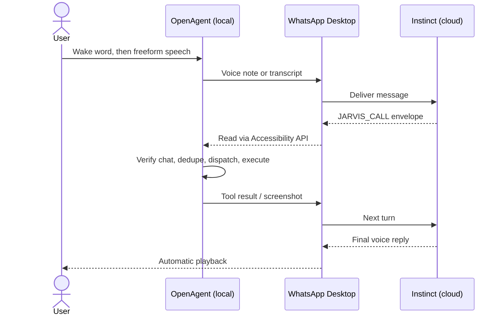

<div align="center">

# OpenAgent ⌘

**Say "Wake up, Jarvis." Then just talk.**<br/>
OpenAgent is the local macOS body for [Instinct](https://instinct.com/). It's an always-listening, hands-free assistant that operates your Mac, your browser, the web and your social accounts while you get on with your day.

[](https://apple.com)
[](https://www.python.org/)
[](https://astral.sh/uv)
[](https://bun.sh)
[]()
[](LICENSE)
[]()

[Quick Start](#quick-start) · [Talking to Jarvis](#talking-to-jarvis) · [Why OpenAgent](#why-openagent) · [How It Works](#how-it-works) · [Features](#core-features) · [Tool Suite](#tool-suite) · [Configuration](#configuration) · [Docs](#documentation) · [Contributing](#contributing)

https://github.com/user-attachments/assets/627ceeab-4194-4f79-a7d5-c98e72197949


</div>

---

OpenAgent connects [Instinct](https://instinct.com/), a personal AI assistant that lives in your messaging apps, to your Mac and gives it a voice interface modeled on Jarvis. Start it once and say **"Wake up, Jarvis."** From then on. You speak naturally from anywhere in the room, and Instinct reasons over each request while OpenAgent carries it out locally: shell commands, code edits, native app control, your authenticated Chrome, self-hosted web scraping and your social media accounts. Replies come back out loud, and screenshots & results land in your chat.

The two halves together make up a personal assistant that can act in the cloud and on your desktop.

```text
[ Jarvis sleeping ]

You (making coffee):  "Wake up, Jarvis."
[ Jarvis awake ]

You:       "Run the test suite on OpenAgent. If it's green, post a Threads update
            about what I shipped today."
             bash               ./test.py                              195 passed
             bash               git log --since=midnight --oneline     6 commits
             social_dedup_check threads / post                         not yet posted
             social_post        threads.net (authenticated profile)    published
Jarvis:    "All 195 tests passed. The update is live on Threads."

You (from the couch):  "Show me what it looks like."
             social_screenshot  live Chrome session                    delivered to WhatsApp
Jarvis:    "Screenshot's in your chat."

You:       "Jarvis, stand by."  →  "Confirm stand by, Jarvis."
[ Jarvis sleeping ]
```

## Talking to Jarvis

OpenAgent is built around **continuous, hands-free conversation**: the way Tony Stark talks to Jarvis while he's working, making coffee or watching TV.

- **Wake once, keep talking.** Say *"Wake up, Jarvis"* (or *"Hey Jarvis"*) and the session stays awake. Speak naturally, pause, and the request is sent after a stretch of silence.
- **Natural turn-taking.** Instinct's voice replies play automatically through your speakers. 
- **Freeform follow-ups.** The conversation lives in your Instinct chat, so context carries across turns. *"Now do the same for Reddit"* or *"Make it shorter"* works the way you'd expect.
- **Private by default.** Wake-word detection (Vosk) runs fully offline, and idle audio is never saved or sent. Nothing leaves your Mac until Jarvis is awake and you've spoken a request.
- **Push-to-talk fallback.** For quiet environments or shared spaces, hold `F8` to talk instead.

## Why OpenAgent

[Instinct](https://instinct.com/) is an invite-only personal AI assistant that works entirely through iMessage and WhatsApp. It has no app and no dashboard: you text it, send a voice note or call it. Instinct works as a chief of staff rather than a chatbot. It books appointments, manages travel, disputes bills, cancels subscriptions and reaches out on its own to follow up on deadlines. It connects to services like GitHub, Google and Notion, and it handles general computer work on virtual desktops in its own cloud.

Because that computer use happens in Instinct's cloud environment, it can reach your **accounts** but not your **machine**. OpenAgent closes that gap:

| Capability | Instinct | Instinct + OpenAgent |
| :--- | :---: | :---: |
| Always-listening, hands-free voice sessions at your desk | — | ✓ |
| Account-level tasks (email, calendar, GitHub, Notion) | ✓ | ✓ |
| Proactive reminders and follow-ups | ✓ | ✓ |
| Shell execution and code edits on your local machine | — | ✓ |
| Seeing your screen and controlling native macOS apps | — | ✓ |
| Driving your authenticated, everyday Chrome profile | — | ✓ |
| Operating WhatsApp Desktop | — | ✓ |
| Posting and engaging on Threads, Reddit, X, LinkedIn and more from your own browser sessions | — | ✓ |
| Private, self-hosted web scraping and crawling | — | ✓ |

<div align="center">
  <strong>Instinct thinks. OpenAgent acts.</strong><br/>
</div>

## How It Works

OpenAgent uses **WhatsApp Desktop as the transport** between Instinct and your Mac. You don't need an API key, a hosted backend or a custom integration.

1. **Input.** Once woken with *"Wake up, Jarvis"*, OpenAgent listens continuously to your speech until a natural pause, and then sends either a voice note or a local Whisper transcript to your Instinct chat.
2. **Tool calls.** Instinct replies with structured calls wrapped in a `JARVIS_CALL:<base64-JSON>:END` envelope. Base64 encoding protects the payload from WhatsApp's markdown formatting, which removes characters like `*`, `_` and `~`.
3. **Observation.** OpenAgent reads incoming messages through the macOS Accessibility API.
4. **Verification.** A fail-closed guard confirms the message came from the verified Instinct chat.
5. **Execution.** The dispatcher routes the call to one of five engines and runs it locally.
6. **Response.** Results, diffs and screenshots go back into the chat. Instinct continues the loop until the task is complete, and its voice replies play back automatically.



## Core Features

| Engine | What it gives Instinct | Built on |
| :--- | :--- | :--- |
| **Developer Harness** | Sandboxed `bash`, paginated `read`, atomic `write`, exact-match `edit`, `ripgrep` search, `glob`, AppleScript | Bun + TypeScript |
| **Voice Interface** | Offline wake word, continuous hands-free sessions, silence-based turn-taking, echo guard, automatic reply playback | Vosk, whisper.cpp, SoX |
| **Native Computer Use** | Window capture, Accessibility tree queries, PID-targeted clicks, keystrokes, drags and scrolls that don't steal focus | macOS Accessibility & Quartz |
| **Real Browser Control** | Your authenticated Chrome: background tabs, compositor clicks through iframes and shadow DOM, framework-safe form filling, 97 site-specific domain skills | Browser Harness (CDP) |
| **Web Ingestion** | Scrape to Markdown, search with full-content results, recursive crawl, site mapping, schema-based JSON extraction | Self-hosted Firecrawl (Docker) |
| **Social Automation** | Posting, replies, likes, search and scheduled workflows on Threads and Reddit (plus X, LinkedIn, Instagram, Facebook, YouTube, TikTok, GitHub) in isolated, persistent Chrome profiles | LocoAgent (CDP) |

**Self-healing runtime.** `boot.py` provisions its own environment, installs missing dependencies, downloads speech models, restarts the agent (and its listening session) with exponential backoff and keeps WhatsApp Desktop alive in the background. `./boot.py --doctor` runs a full preflight audit.

## Quick Start

### Prerequisites

* macOS 14 (Sonoma) or macOS 15 (Sequoia) on Apple Silicon or Intel
* [uv](https://astral.sh/uv) (Astral Python package and project manager)
* [Homebrew](https://brew.sh/) & [Bun](https://bun.sh/)
* Official **WhatsApp Desktop** installed and logged in

### 1. One-Command Autonomous Python Scripts

OpenAgent includes dedicated, single-command Python scripts for all lifecycle tasks:

| Script | Purpose | Common Command |
| :--- | :--- | :--- |
| **[`boot.py`](boot.py)** | **Autonomous Boot & Watchdog** | `./boot.py` (or `python3 boot.py`) |
| **[`install.py`](install.py)** | **Full Zero-Touch Installation** | `./install.py` (or `python3 install.py`) |
| **[`calibrate.py`](calibrate.py)** | **WhatsApp UI Auto-Calibration** | `./calibrate.py --save` |
| **[`test.py`](test.py)** | **Comprehensive Test Runner** | `./test.py` |

#### Quick Start:
```bash
git clone https://github.com/GitCoder052023/OpenAgent.git
cd OpenAgent

# 1. Full system installation (homebrew tools, venv, bun harness, speech models)
./install.py

# 2. Calibrate WhatsApp Desktop UI paths and labels (auto-detected)
./calibrate.py --save

# 3. Verify entire system with test suite
./test.py

# 4. Launch Jarvis with hands-free wake word enabled
./boot.py --voice --send-mode audio
```

`boot.py` is an autonomous, self-bootstrapping orchestrator and supervisor:
* **Self-Bootstrapping**: Auto-detects runtime, provisions/syncs virtual environment with `uv`, and re-execs inside `.venv` without manual activation.
* **Auto-Healing Dependencies**: Auto-resolves and installs Homebrew tools (`uv`, `bun`, `sox`, `ffmpeg`, `ripgrep`, `whisper-cpp`) and Bun harness modules.
* **Model Provisioning**: Automatically downloads offline speech models (Whisper ggml & Vosk wake models).
* **Self-Healing Supervisor Watchdog**: Supervises the agent process, re-starts OpenAgent on crashes with exponential backoff, and keeps WhatsApp Desktop backgrounded and alive.
* **Interactive Diagnostics**: Run `./boot.py --doctor` to conduct a zero-touch preflight audit of all hardware, harnesses, and permissions.

```bash
# Common launch commands:
./boot.py --voice --send-mode audio  # Recommended: hands-free wake word ("Wake up Jarvis")
./boot.py                           # Push-to-talk mode (hold F8 to speak)
./boot.py --doctor                  # Run preflight health check without starting agent
./boot.py --voice --send-mode text  # Wake-word mode with local Whisper STT transcription
./boot.py --start-firecrawl         # Auto-spinup Firecrawl Docker scraper engine
./boot.py --start-chrome            # Auto-launch Chrome with remote debugging on port 9222
./calibrate.py --dump               # Dump sanitized AX UI tree for deep debugging
./test.py --unit                    # Run only unit test suite
./test.py --harness                 # Test live Bun IPC harness
```


### 2. Grant macOS Permissions

Open **System Settings → Privacy & Security** and verify permissions for your terminal application:

* **Accessibility**: UI inspection and desktop automation
* **Input Monitoring**: Global push-to-talk hotkey (`F8`)
* **Microphone**: Audio recording via SoX
* **Screen Recording**: Window capture (`mac_see`)
* **Automation**: System Events and AppleScript app control

### 3. Connect Instinct (One-Time)

Once OpenAgent is running, initialize Instinct with its capabilities:

1. Open [`docs/JARVIS_INSTRUCTIONS.md`](docs/JARVIS_INSTRUCTIONS.md).  
   > ⚠️ **Note for Readers:** `docs/JARVIS_INSTRUCTIONS.md` is the author's personal setup and operational file (containing his personal accounts, subreddits, and persona guidelines). You will need to edit it according to your own name, social media handles, accounts, and requirements before sending it to your agent.
2. Copy the initialization instruction prompt.
3. Paste it directly into your WhatsApp chat with Instinct.

Instinct will recognize the `JARVIS_CALL` protocol and begin executing tasks on your Mac!

## How to Operate

**Jarvis mode (recommended).** Start OpenAgent with continuous listening enabled:

```bash
./boot.py --voice --send-mode audio
```

**Push-to-talk.** Start with `./boot.py` (or `./start.sh`). Hold `F8`, speak, then release to send. Holding `F8` during a reply cuts the reply short. Press `Esc` to cancel or exit.

## Tool Suite

Instinct calls tools by wrapping structured JSON in a transport envelope:
`JARVIS_CALL:<base64-encoded-JSON>:END`.

There are 55+ tools across five engines. Expand a section for the full reference.

<details>
<summary><b>Developer Harness Tools</b> (8 tools)</summary>

| Tool | Description | Key Arguments |
| --- | --- | --- |
| `bash` | Execute shell commands in `zsh` | `command`, `cwd`, `timeout_ms` |
| `read` | Read file contents or list directories with pagination | `path`, `offset`, `limit` |
| `write` | Atomically write or overwrite files | `path`, `content` |
| `edit` | Exact chunk search-and-replace with unified diff output | `path`, `old_string`, `new_string` |
| `grep` | High-speed regex code search via `ripgrep` | `pattern`, `path` |
| `glob` | Find files matching glob patterns | `pattern`, `path` |
| `applescript` | Execute multiline native AppleScript via `osascript` | `script` |
| `system_info` | Inspect local OS version, hardware, and runtime status | *(none)* |

</details>

<details>
<summary><b>Native macOS Computer-Use Tools</b> (10 tools)</summary>

| Tool | Description | Key Arguments |
| --- | --- | --- |
| `mac_see` | Capture window screenshot and extract interactive UI elements | `app`, `send_image`, `include_summary` |
| `mac_click` | PID-targeted mouse click without stealing focus | `x`, `y`, `app`, `button`, `click_count` |
| `mac_type` | Type text directly into a target application | `text`, `app` |
| `mac_key` | Trigger keyboard shortcuts (e.g., `cmd+s`, `enter`) | `key`, `app` |
| `mac_drag` | Perform drag-and-drop operations | `start_x`, `start_y`, `end_x`, `end_y`, `app` |
| `mac_scroll` | Send directional scroll events | `x`, `y`, `dx`, `dy`, `app` |
| `mac_apps` | List all running applications with process IDs | *(none)* |
| `mac_windows` | List open window titles and bounds for an application | `app` |
| `mac_ax` | Query and interact with macOS Accessibility elements | `action`, `app`, `text` |
| `mac_python` | Run compound, multi-step UI workflows locally in Python | `code` |

</details>

<details>
<summary><b>Real Browser Control Tools (Browser Harness CDP)</b> (14 tools)</summary>

| Tool | Description | Key Arguments |
| --- | --- | --- |
| `browser_open` | Navigate or open a new tab in your authenticated Chrome session | `url`, `new_tab` |
| `browser_info` | Inspect page URL, title, viewport dimensions, and scroll offset | *(none)* |
| `browser_click` | Composited CDP mouse click bypassing iframes/shadow DOM | `x`, `y`, `selector`, `button`, `click_count` |
| `browser_fill` | Framework-safe form input (React/Vue synthetic events) | `selector`, `text`, `clear_first`, `timeout` |
| `browser_type` | Type text into currently focused web element | `text` |
| `browser_key` | Trigger web keyboard shortcuts (`Enter`, `Escape`, `Tab`, `Backspace`) | `key`, `modifiers` |
| `browser_scroll` | Scroll by delta pixels or scroll element into view | `dx`, `dy`, `selector` |
| `browser_tabs` | Background tab management (`list`, `new`, `switch`, `close`, `current`) | `action`, `target`, `url` |
| `browser_see` | Inspect tab state and send visual screenshot to WhatsApp | `send_image`, `max_elements` |
| `browser_ax` | Discover buttons/inputs via internal Accessibility Tree | `action`, `text`, `role`, `limit` |
| `browser_eval` | Evaluate JavaScript in the active tab context | `expression` |
| `browser_wait` | Wait for page load, network idle, or element appearance | `for_what`, `selector`, `timeout` |
| `browser_python` | Ultra-fast compound browser burst execution (<200ms) | `code`, `timeout` |
| `domain_skills` | Retrieve pre-built domain automation skills for 80+ platforms | `host` |

</details>

<details>
<summary><b>Self-Hosted Web Ingestion & Extraction Tools (Firecrawl Engine)</b> (7 tools)</summary>

| Tool | Description | Key Arguments |
| --- | --- | --- |
| `firecrawl_scrape` | Scrape dynamic web pages directly into clean LLM Markdown | `url`, `formats`, `only_main_content`, `wait_for` |
| `firecrawl_search` | Search the web and return full Markdown from top hits in one shot | `query`, `limit`, `scrape_options` |
| `firecrawl_crawl` | Asynchronously crawl an entire domain or documentation tree | `url`, `max_depth`, `limit` |
| `firecrawl_status` | Check the progress and page count of an ongoing crawl | `job_id` |
| `firecrawl_map` | Fast sitemap and URL discovery across a domain | `url`, `search`, `limit` |
| `firecrawl_extract` | Extract structured JSON data matching a schema or prompt | `urls`, `prompt`, `schema` |
| `firecrawl_doctor` | Inspect health of self-hosted local Firecrawl daemon | *(none)* |

</details>

<details>
<summary><b>Social Media Automation Tools (LocoAgent Engine)</b> (13 tools)</summary>

Operate real social accounts with primary focus on **Threads (`threads.net`) and Reddit (`reddit.com`)** (plus X/Twitter, LinkedIn, Instagram, Facebook, YouTube, TikTok, and GitHub) with persistent anti-detection Chrome profiles:

| Tool | Description | Key Arguments |
| --- | --- | --- |
| `social_targets` | Inspect all configured social platforms and live CDP port status | *(none)* |
| `social_setup` | Launch persistent, isolated Chrome browser for a social platform | `target`, `all`, `reset` |
| `social_post` | Publish a post or tweet with optional image/media attachment | `text`, `platform`, `media` |
| `social_reply` | Reply to a post or tweet with anti-deduplication check | `url`, `text`, `platform` |
| `social_like` | Like or react to a post with anti-deduplication check | `url`, `platform` |
| `social_search` | Search social media discussions by keyword/hashtag | `query`, `platform`, `tab` |
| `social_screenshot` | Capture live social feed screenshot delivered to WhatsApp | `platform`, `full`, `annotate` |
| `social_workflow` | Control automation pipelines (`run`, `start`, `stop`, `daemon`, `status`) | `action`, `id`, `interval` |
| `social_agent_task` | Delegate an end-to-end autonomous social media mission | `prompt`, `model`, `timeout` |
| `social_dedup_check` | Check if a URL was already interacted with in persistent ledger | `platform`, `action`, `url` |
| `social_log` | Record a successful interaction into the operation log | `platform`, `action`, `url`, `status`, `note` |
| `social_exec` | Execute direct `agent-browser` CDP command on any target | `platform`, `command` |
| `social_doctor` | Run health checks on Bun, agent-browser CLI, and Chrome CDP | *(none)* |

</details>

> Full schema specifications and example payloads are available in [`docs/JARVIS_INSTRUCTIONS.md`](docs/JARVIS_INSTRUCTIONS.md).

## Configuration

OpenAgent is configured via `.env` in the project root:

| Variable | Default | Description |
| --- | --- | --- |
| `BRIDGE_WHATSAPP_NUMBER` | `+16508702892` | WhatsApp phone number for your Instinct agent |
| `BRIDGE_SAFE_MODE` | `true` | Restrict execution strictly to the verified chat header |
| `BRIDGE_HOTKEY` | `f8` | Push-to-talk hotkey (`f8`, `f6`, `right_shift`, etc.) |
| `BRIDGE_SEND_MODE` | `audio` | `audio` (sends AAC/M4A voice note) or `text` (local Whisper STT) |
| `BRIDGE_SEND_ROUTE` | `picker` | Send route: `picker` (native attachment), `clipboard`, or `auto` |
| `BRIDGE_WHISPER_MODEL` | `models/ggml-base.bin` | Path to offline Whisper model |
| `BRIDGE_VOICE_MODEL` | `models/vosk-model-...` | Path to offline Vosk wake-word model |
| `BRIDGE_VOICE_SILENCE_SECONDS` | `2.0` | Silence delay before auto-submitting voice input |
| `BH_AGENT_WORKSPACE` | `src/tools/browser-harness/agent-workspace` | Directory for agent-editable helpers and domain skills |
| `BH_DOMAIN_SKILLS` | `1` | Enable site-specific domain skill recipes |
| `BH_TAB_MARKER` | `1` | Enable horse emoji (`🐎`) marker on agent-managed tabs |
| `FIRECRAWL_API_URL` | `http://localhost:3002` | Local self-hosted Firecrawl API daemon endpoint |
| `FIRECRAWL_API_KEY` | *(empty)* | Optional API key (unauthenticated by default when self-hosting) |
| `FIRECRAWL_TIMEOUT` | `60.0` | Timeout in seconds for web scraping and crawls |
| `LOCOAGENT_ENABLED` | `true` | Enable LocoAgent social automation engine |
| `LOCOAGENT_ROOT` | `src/tools/locoagent` | Directory path for LocoAgent checkout |
| `LOCOAGENT_DEFAULT_PLATFORM` | `threads` | Default social media target platform |
| `LOCOAGENT_TIMEOUT` | `120.0` | Timeout in seconds for social automation commands |
| `BRIDGE_LOG_FILE` | `~/Library/Logs/OpenAgent/bridge.jsonl` | Diagnostic JSONL event log path |

## Testing & Diagnostics

Run the comprehensive pytest suite:

```bash
uv run pytest
```

Run the macOS native adapter health check:

```bash
uv run python -c "from OpenAgent.mac_adapter import MacAdapter; print(MacAdapter().doctor())"
```

Stream live runtime logs:

```bash
tail -f ~/Library/Logs/OpenAgent/bridge.jsonl

```

For advanced Accessibility tree inspection and calibration, see [`docs/CALIBRATION.md`](docs/CALIBRATION.md).

## Documentation

- [Setup Prompt & Tool Instructions](docs/JARVIS_INSTRUCTIONS.md) — Initialization block to connect Instinct. *(Note: Author's personal operational configuration — edit according to your own name, handles, and requirements.)*
- [Social Media Automation Guide](docs/SOCIAL_MEDIA_AUTOMATION.md) — Architecture, platform ports, and operational guide for Threads & Reddit.
- [Accessibility & Calibration Guide](docs/CALIBRATION.md) — Deep calibration for AX trees, audio routing, and debug states.
- [Security Policy](SECURITY.md) — Security model, threat boundaries, and vulnerability reporting.
- [Contributing Guide](CONTRIBUTING.md) — Development workflow, testing, and tool additions.

---

## Contributing

Contributions are welcome. High-impact areas include:

- New macOS harness primitives and tool adapters
- Voice pipeline latency and wake-word accuracy
- Browser domain skills for additional sites
- LocoAgent workflows and platform playbooks
- Safety guards, auditing and sandboxing

See [`CONTRIBUTING.md`](CONTRIBUTING.md) for the development workflow and [`CODE_OF_CONDUCT.md`](CODE_OF_CONDUCT.md) for community guidelines.

## Credits & Acknowledgments

OpenAgent is built with gratitude on the shoulders of the open-source agent tooling community:
- **[OpenCode](https://github.com/anomalyco/opencode)** — Inspiring open-source agentic coding architectures.
- **[Browser Use](https://github.com/browser-use/browser-use)** — Directly integrating **[Browser Harness](https://github.com/browser-use/browser-harness)** for high-speed Chrome CDP automation and domain skills, alongside **[macOS Harness](https://github.com/browser-use/macos-harness)** for pioneering native macOS computer-use foundations.
- **[whisper.cpp](https://github.com/ggerganov/whisper.cpp)** & **[Vosk](https://alphacephei.com/vosk/)** — Lightweight, local, low-latency audio intelligence.
- **[Firecrawl](https://github.com/firecrawl/firecrawl)** — Pioneering open-source web scraping, crawling, and clean LLM markdown extraction engine.
- **[LocoAgent](https://github.com/LocoreMind/locoagent)** — Autonomous social media agent by LocoreMind providing persistent real-browser sessions, operation deduplication, and platform playbooks.

---

<div align="center">
  <sub>OpenAgent is open-source software licensed under the <a href="LICENSE">MIT License</a>.</sub>
</div>