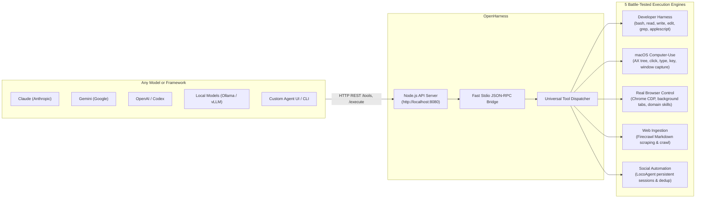

<div align="center">

# OpenHarness ⌘
### By [OpenAgent](https://github.com/GitCoder052023/OpenAgent)

**The unified, model-agnostic macOS execution harness for autonomous agents.**<br/>
Expose 55+ developer, native desktop, browser, web scraping, and social automation tools to **Claude, Gemini, Codex, local models, and agent frameworks** via a lightweight Node.js API server.

[](https://apple.com)
[](https://nodejs.org/)
[](https://bun.sh)
[](https://www.python.org/)
[](https://astral.sh/uv)
[]()
[](LICENSE)
[](https://github.com/GitCoder052023/OpenAgent)

[Why OpenHarness](#why-openharness) · [Architecture](#how-it-works) · [Engines & Tools](#core-engines--tools) · [HTTP API Server](#http-api-server) · [Documentation](#documentation)

</div>

---

## What is OpenHarness?

**OpenHarness is the headless, model-agnostic execution engine created by [OpenAgent](https://github.com/GitCoder052023/OpenAgent).**

While **OpenAgent** is the voice-driven, hands-free personal assistant body for Instinct over WhatsApp Desktop (handling microphone input, Vosk wake-word detection, Whisper speech-to-text, and messaging transports), **OpenHarness** is the top-level execution harness extracted into its own clean, dedicated repository.

Just like **Next.js** or **Skills** is by **Vercel**, **OpenHarness is by OpenAgent**.

### The Motivation

In OpenAgent, Jarvis and Instinct leverage a battle-tested harness of 55+ local tools to operate macOS, control authenticated Chrome, edit code, crawl the web, and manage social media. 

Previously, anyone who wanted to give those powerful capabilities to other models—such as **Claude, Gemini, OpenAI / Codex, DeepSeek, or local Ollama models**—had to clone the entire OpenAgent repository and manually strip out WhatsApp automation, accessibility scrapers, audio loops, and speech models.

**OpenHarness solves this completely:**
- **Zero WhatsApp or Audio Bloat:** The codebase is cleaned and dedicated purely to harness execution.
- **Model-Agnostic:** Any LLM, UI, agent framework, or backend can connect immediately.
- **Lightweight Node.js + TypeScript API:** Exposes execution capabilities over standard HTTP (`GET /health`, `POST /api/execute`).
- **Sub-Millisecond IPC Dispatch:** Uses a persistent stdio JSON worker keeping adapters warm in memory.

---

## How It Works



---

## Core Engines & Tools

OpenHarness gives your AI agent direct access to **55+ tools** across 5 specialized engines:

| Engine | Capabilities | Key Tools |
| :--- | :--- | :--- |
| **Developer Harness** | Sandboxed `bash`, paginated `read`, atomic `write`, exact-match `edit` with unified diffs, `ripgrep` search, `glob`, native `applescript`, system info | `bash`, `read`, `write`, `edit`, `grep`, `glob`, `applescript`, `system_info` |
| **Native macOS Computer-Use** | Window screenshot inspection, Accessibility tree queries, PID-targeted clicks, keystrokes, drag-and-drop, directional scrolls that don't steal focus | `mac_see`, `mac_click`, `mac_type`, `mac_key`, `mac_drag`, `mac_scroll`, `mac_apps`, `mac_windows`, `mac_ax`, `mac_python` |
| **Real Browser Control** | Authenticated Chrome control via CDP: background tabs, compositor clicks through iframes and shadow DOM, framework-safe form filling | `browser_open`, `browser_info`, `browser_click`, `browser_fill`, `browser_type`, `browser_key`, `browser_scroll`, `browser_tabs`, `browser_see`, `browser_eval` |
| **Web Ingestion & Scraping** | Scrape dynamic web pages directly into clean LLM Markdown, full web search, recursive domain crawling, sitemaps, JSON schema extraction | `firecrawl_scrape`, `firecrawl_search`, `firecrawl_crawl`, `firecrawl_status`, `firecrawl_map`, `firecrawl_extract`, `firecrawl_doctor` |
| **Social Media Automation** | Persistent Chrome sessions on Threads, Reddit, X, LinkedIn, Instagram, YouTube, TikTok: publishing, anti-deduplication checks, replies, screenshot verification | `social_targets`, `social_setup`, `social_post`, `social_reply`, `social_like`, `social_search`, `social_screenshot`, `social_dedup_check`, `social_agent_task` |

---

## HTTP API Server

OpenHarness includes a lightweight Node.js + TypeScript + Express HTTP API server located under `./src/server`. It acts strictly as an execution transport layer over a persistent Python worker.

> [!WARNING]
> **Security Notice**: This API exposes local execution capabilities (shell commands, file operations, system automation). By default, the server binds to `0.0.0.0` for local area network access. **Never expose this service to the public internet**; only run it on trusted local networks.

### Starting the Server

```bash
# Start server
pnpm run server
# or
pnpm start
```

### Configuration

The server binds to `0.0.0.0:8080` by default. Configure via environment variables:

- `OPENHARNESS_HOST`: Host interface to bind (default: `0.0.0.0`)
- `OPENHARNESS_PORT`: Port to listen on (default: `8080`)
- `OPENHARNESS_TIMEOUT_MS`: Request timeout in milliseconds (default: `120000`)

### Endpoints

#### 1. Health Check

```http
GET /health
```

**Response (`200 OK`):**

```json
{
  "status": "ok",
  "worker": "ready"
}
```

#### 2. Tool Execution

```http
POST /api/execute
Content-Type: application/json
```

**Request Example:**

```json
{
  "tool": "bash",
  "args": {
    "command": "uname -a"
  }
}
```

**Response Example (Success):**

```json
{
  "status": "ok",
  "tool": "bash",
  "result": {
    "exit_code": 0,
    "output": "Darwin Kernel Version ...\n",
    "timed_out": false,
    "truncated": false,
    "cwd": "/Users/hamdan/OpenHarness"
  }
}
```

**Response Example (Execution Error):**

```json
{
  "status": "error",
  "tool": "bash",
  "error": "Command failed with exit code 1"
}
```

---

## Documentation

- [Social Media Automation](docs/SOCIAL_MEDIA_AUTOMATION.md) — Guide for LocoAgent browser profiles on Threads and Reddit.
- [Contributing Guide](CONTRIBUTING.md) — Development workflow and how to add new tools.

---

## Credits & Hierarchy

* **[OpenAgent](https://github.com/GitCoder052023/OpenAgent)** — The parent project and inspiration for OpenHarness. OpenAgent is the always-listening, hands-free personal assistant for Instinct over WhatsApp.
* **OpenHarness** is developed and maintained as part of the OpenAgent ecosystem.
* Built with gratitude to **OpenCode**, **Browser Use**, **Firecrawl**, and **LocoAgent**.

---

<div align="center">
  <sub>OpenHarness is open-source software licensed under the <a href="LICENSE">MIT License</a>.</sub>
</div>