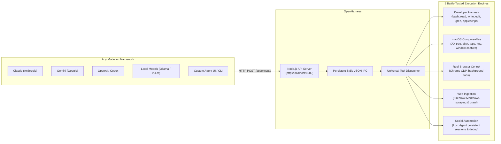

<div align="center">

# OpenHarness ⌘
### By [OpenAgent](https://github.com/GitCoder052023/OpenAgent)

**The unified, model-agnostic macOS execution harness for autonomous agents.**<br/>
Expose 55+ developer, native desktop, browser, web scraping, and social automation tools to **Claude, Gemini, Codex, local models, and agent frameworks** via a lightweight Node.js API server.

[](https://apple.com)
[](https://nodejs.org/)
[](https://bun.sh)
[](https://www.python.org/)
[](https://astral.sh/uv)
[]()
[](LICENSE)
[](https://github.com/GitCoder052023/OpenAgent)

[Why OpenHarness](#why-openharness) · [Architecture](#how-it-works) · [Engines & Tools](#core-engines--tools) · [Local API Server](#local-api-server) · [Documentation](#documentation)

</div>

---

## What is OpenHarness?

**OpenHarness is the headless, model-agnostic execution engine created by [OpenAgent](https://github.com/GitCoder052023/OpenAgent).**

While **OpenAgent** is the voice-driven, hands-free personal assistant body for Instinct over WhatsApp Desktop (handling microphone input, Vosk wake-word detection, Whisper speech-to-text, and messaging transports), **OpenHarness** is the top-level execution harness extracted into its own clean, dedicated repository.

Just like **Next.js** or **Skills** is by **Vercel**, **OpenHarness is by OpenAgent**.

### The Motivation

In OpenAgent, Jarvis and Instinct leverage a battle-tested harness of 55+ local tools to operate macOS, control authenticated Chrome, edit code, crawl the web, and manage social media. 

Previously, anyone who wanted to give those powerful capabilities to other models—such as **Claude, Gemini, OpenAI / Codex, DeepSeek, or local Ollama models**—had to clone the entire OpenAgent repository and manually strip out WhatsApp automation, accessibility scrapers, audio loops, and speech models.

**OpenHarness solves this completely:**
- **Zero WhatsApp or Audio Bloat:** The codebase is cleaned and dedicated purely to harness execution.
- **Model-Agnostic:** Any LLM, UI, agent framework, or backend can connect immediately.
- **Lightweight Node.js + TypeScript API:** Exposes execution capabilities over standard HTTP (`GET /health`, `POST /api/execute`).
- **Sub-Millisecond IPC Dispatch:** Uses a persistent stdio JSON worker keeping adapters warm in memory.

---

## How It Works



---

## Core Engines & Tools

OpenHarness gives your AI agent direct access to **55+ tools** across 5 specialized engines:

| Engine | Capabilities | Key Tools |
| :--- | :--- | :--- |
| **Developer Harness** | Sandboxed `bash`, paginated `read`, atomic `write`, exact-match `edit` with unified diffs, `ripgrep` search, `glob`, native `applescript`, system info | `bash`, `read`, `write`, `edit`, `grep`, `glob`, `applescript`, `system_info` |
| **Native macOS Computer-Use** | Window screenshot inspection, Accessibility tree queries, PID-targeted clicks, keystrokes, drag-and-drop, directional scrolls that don't steal focus | `mac_see`, `mac_click`, `mac_type`, `mac_key`, `mac_drag`, `mac_scroll`, `mac_apps`, `mac_windows`, `mac_ax`, `mac_python` |
| **Real Browser Control** | Authenticated Chrome control via CDP: background tabs, compositor clicks through iframes and shadow DOM, framework-safe form filling | `browser_open`, `browser_info`, `browser_click`, `browser_fill`, `browser_type`, `browser_key`, `browser_scroll`, `browser_tabs`, `browser_see`, `browser_eval` |
| **Web Ingestion & Scraping** | Scrape dynamic web pages directly into clean LLM Markdown, full web search, recursive domain crawling, sitemaps, JSON schema extraction | `firecrawl_scrape`, `firecrawl_search`, `firecrawl_crawl`, `firecrawl_status`, `firecrawl_map`, `firecrawl_extract`, `firecrawl_doctor` |
| **Social Media Automation** | Persistent Chrome sessions on Threads, Reddit, X, LinkedIn, Instagram, YouTube, TikTok: publishing, anti-deduplication checks, replies, screenshot verification | `social_targets`, `social_setup`, `social_post`, `social_reply`, `social_like`, `social_search`, `social_screenshot`, `social_dedup_check`, `social_agent_task` |

---

## Local API Server

OpenHarness provides a lightweight Node.js + TypeScript + Express HTTP server located under `./src/server`. It exposes local machine execution capabilities over HTTP for autonomous agents, external scripts, and local network clients.

The server functions strictly as an **execution transport layer**. A client submits a tool name and arguments via HTTP JSON. The server forwards the payload across a persistent stdio IPC connection to the underlying OpenHarness worker, executes the requested tool, and returns the result back to the client.

The API server does not perform model inference, agent orchestration, prompt expansion, or tool translation. It is an unopinionated bridge between HTTP and OpenHarness execution.

### Architecture

```text
Client
  │
  │ HTTP JSON (POST /api/execute)
  ▼
OpenHarness API Server (Node.js / Express)
  │
  │ Stdio JSON IPC (Request ID correlated)
  ▼
OpenHarness Worker (Persistent Python Process)
  │
  ▼
OpenHarness Execution Layer (Dispatcher)
  │
  ▼
Harness Engines (Developer, macOS, Browser, Web, Social)
  │
  ▼
Execution Result
  │
  └───────────────────────────────► Client (HTTP JSON Response)
```

The Node.js server maintains a single, persistent Python worker process (`python -m openharness.worker`) across requests, avoiding process initialization overhead and keeping adapters warm in memory.

### Starting the Server

Start the API server using pnpm:

```bash
# Production / standard mode
pnpm run server
# or
pnpm start

# Development mode (with file watcher)
pnpm run dev
```

During startup, the server boots the persistent Python worker, confirms readiness, and binds to the configured network interface:

```text
[INFO] Starting Python worker using /Users/hamdan/OpenHarness/.venv/bin/python...
[INFO] Python worker is ready
[INFO] OpenHarness API listening on http://0.0.0.0:8080
```

### Configuration

Server settings are configured via environment variables:

| Variable | Default | Description |
|---|---|---|
| `OPENHARNESS_HOST` | `0.0.0.0` | Network interface to bind (`0.0.0.0` for LAN access, `127.0.0.1` for localhost only) |
| `OPENHARNESS_PORT` | `8080` | Port number to listen on |
| `OPENHARNESS_TIMEOUT_MS` | `120000` | Transport request timeout in milliseconds (default: 2 minutes) |
| `OPENHARNESS_PYTHON` | Auto | Path to Python interpreter (defaults to `.venv/bin/python` or `python3`) |

### Network Topology & LAN Access

By default, the server binds to `0.0.0.0:8080`, allowing trusted devices on your local area network (LAN) to access OpenHarness:

```text
Host Machine (Mac running OpenHarness)
       │
       │ Wi-Fi / Ethernet LAN (0.0.0.0:8080)
       ▼
 ┌───────────────┬───────────────┬─────────────────────────┐
 │               │               │                         │
Laptop         Phone       AI Agent / Client        Dev Machine
```

Clients on the same local network can target the host machine's local IP address:
```
http://<your-host-lan-ip>:8080/api/execute
```

To restrict access exclusively to the local host machine, set `OPENHARNESS_HOST=127.0.0.1`.

### Security Warning

> [!WARNING]
> **Security Notice**: The OpenHarness API server exposes arbitrary local execution capabilities (shell commands, file system read/write, native macOS automation) over unauthenticated HTTP.
>
> - **Trusted Networks Only**: Bind to `0.0.0.0` only on private, trusted local networks. Anyone who can reach this port can execute tools on the host machine.
> - **Do Not Expose to the Internet**: Never forward port 8080 on your router or bind this service to a public IP address.
> - **No Public Tunnels**: Do not put this service behind public tunneling tools (e.g., Cloudflare Tunnel, ngrok) without an authentication proxy.
> - **Use Localhost When Possible**: If external LAN access is not required, set `OPENHARNESS_HOST=127.0.0.1`.

### API Reference

#### 1. Health Check

Verifies that the HTTP process is running and reports the status of the background Python worker process without executing any tools.

```http
GET /health
```

**Example Request:**

```bash
curl http://localhost:8080/health
```

**Response (`200 OK`):**

```json
{
  "status": "ok",
  "worker": "ready"
}
```

If the Python worker has exited or failed to initialize, the endpoint returns:

```json
{
  "status": "ok",
  "worker": "unavailable"
}
```

#### 2. Service Info

Returns basic service metadata.

```http
GET /
```

**Example Request:**

```bash
curl http://localhost:8080/
```

**Response (`200 OK`):**

```json
{
  "name": "OpenHarness API",
  "status": "ok"
}
```

#### 3. Execute a Tool

Dispatches a tool call to the OpenHarness execution layer.

```http
POST /api/execute
Content-Type: application/json
```

**Request Body:**

| Field | Type | Required | Description |
|---|---|---|---|
| `tool` | `string` | Yes | Name of the tool to execute (e.g. `bash`, `read`, `write`, `grep`, `glob`, `applescript`, `system_info`) |
| `args` | `object` | No | Tool arguments dictionary (defaults to `{}`) |

**Request Example:**

```json
{
  "tool": "bash",
  "args": {
    "command": "uname -a"
  }
}
```

**Response (`200 OK` - Success):**

```json
{
  "status": "ok",
  "tool": "bash",
  "result": {
    "exit_code": 0,
    "output": "Darwin Kernel Version 24.3.0 ...\n",
    "timed_out": false,
    "truncated": false,
    "cwd": "/Users/hamdan/OpenHarness"
  }
}
```

### Error Handling

The API clearly differentiates between **HTTP/API transport errors** and **tool execution errors**.

#### Tool Execution Errors (`200 OK`)

When a request is valid and the worker executes the tool, but the tool itself reports a failure (such as an unknown tool name, a non-zero exit code, or an invalid file path), the response retains the OpenHarness execution envelope:

```json
{
  "status": "error",
  "tool": "bash",
  "error": "Command failed with exit code 1"
}
```

#### HTTP / API Errors

Client and server errors return an error JSON envelope with the corresponding HTTP status code:

| Status Code | Reason | Example Response |
|---|---|---|
| `400 Bad Request` | Missing `tool`, non-object `args`, or malformed JSON | `{"status": "error", "error": "Field 'tool' must be a non-empty string"}` |
| `404 Not Found` | Route does not exist | `{"status": "error", "error": "Route not found"}` |
| `503 Service Unavailable` | Python worker crashed or is not ready | `{"status": "error", "error": "OpenHarness worker is unavailable"}` |
| `500 Internal Server Error` | Transport timeout or unhandled server fault | `{"status": "error", "error": "Worker request timed out after 120000ms"}` |

### Client Examples

#### cURL

```bash
# 1. Check health
curl -s http://localhost:8080/health

# 2. Execute a shell command
curl -s -X POST http://localhost:8080/api/execute \
  -H "Content-Type: application/json" \
  -d '{"tool": "bash", "args": {"command": "echo Hello from OpenHarness"}}'

# 3. Read system information
curl -s -X POST http://localhost:8080/api/execute \
  -H "Content-Type: application/json" \
  -d '{"tool": "system_info", "args": {}}'
```

#### JavaScript / TypeScript (Node.js Fetch)

```ts
async function executeTool(tool: string, args: Record<string, unknown> = {}) {
  const response = await fetch("http://localhost:8080/api/execute", {
    method: "POST",
    headers: {
      "Content-Type": "application/json",
    },
    body: JSON.stringify({ tool, args }),
  });

  const data = await response.json();

  if (!response.ok || data.status === "error") {
    throw new Error(data.error || `Execution failed for tool: ${tool}`);
  }

  return data.result;
}

// Example usage
const result = await executeTool("bash", { command: "uname -a" });
console.log(result);
```

---

## Documentation

- [Social Media Automation](docs/SOCIAL_MEDIA_AUTOMATION.md) — Guide for LocoAgent browser profiles on Threads and Reddit.
- [Contributing Guide](CONTRIBUTING.md) — Development workflow and how to add new tools.

---

## Credits & Hierarchy

* **[OpenAgent](https://github.com/GitCoder052023/OpenAgent)** — The parent project and inspiration for OpenHarness. OpenAgent is the always-listening, hands-free personal assistant for Instinct over WhatsApp.
* **OpenHarness** is developed and maintained as part of the OpenAgent ecosystem.
* Built with gratitude to **OpenCode**, **Browser Use**, **Firecrawl**, and **LocoAgent**.

---

<div align="center">
  <sub>OpenHarness is open-source software licensed under the <a href="LICENSE">MIT License</a>.</sub>
</div>