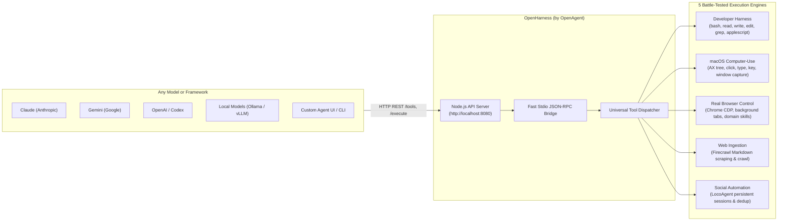

<div align="center">

# OpenHarness ⌘
### By [OpenAgent](https://github.com/GitCoder052023/OpenAgent)

**The unified, model-agnostic macOS execution harness for autonomous agents.**<br/>
Expose 55+ developer, native desktop, browser, web scraping, and social automation tools to **Claude, Gemini, Codex, local models, and agent frameworks** via a lightweight Node.js API server.

[](https://apple.com)
[](https://nodejs.org/)
[](https://bun.sh)
[](https://www.python.org/)
[](https://astral.sh/uv)
[]()
[](LICENSE)
[](https://github.com/GitCoder052023/OpenAgent)

[Quick Start](#quick-start) · [Why OpenHarness](#why-openharness) · [Architecture](#how-it-works) · [Engines & Tools](#core-engines--tools) · [API Reference](#lightweight-nodejs-api-server) · [Roadmap](#future-roadmap) · [Docs](docs/API.md)

</div>

---

## What is OpenHarness?

**OpenHarness is the headless, model-agnostic execution engine created by [OpenAgent](https://github.com/GitCoder052023/OpenAgent).**

While **OpenAgent** is the voice-driven, hands-free personal assistant body for Instinct over WhatsApp Desktop (handling microphone input, Vosk wake-word detection, Whisper speech-to-text, and messaging transports), **OpenHarness** is the top-level execution harness extracted into its own clean, dedicated repository.

Just like **Next.js** or **Skills** is by **Vercel**, **OpenHarness is by OpenAgent**.

### The Motivation

In OpenAgent, Jarvis and Instinct leverage a battle-tested harness of 55+ local tools to operate macOS, control authenticated Chrome, edit code, crawl the web, and manage social media. 

Previously, anyone who wanted to give those powerful capabilities to other models—such as **Claude, Gemini, OpenAI / Codex, DeepSeek, or local Ollama models**—had to clone the entire OpenAgent repository and manually strip out WhatsApp automation, accessibility scrapers, audio loops, and speech models.

**OpenHarness solves this completely:**
- **Zero WhatsApp or Audio Bloat:** The codebase is cleaned and dedicated purely to harness execution.
- **Model-Agnostic:** Any LLM, UI, agent framework, or backend can connect immediately.
- **Lightweight Node.js REST API:** Exposes the entire harness over standard HTTP endpoints (`GET /tools`, `POST /execute`, `POST /tools/:name`).
- **Zero Schema Translation:** Generates ready-to-use function calling schemas for OpenAI (`?format=openai`), Claude (`?format=anthropic`), and MCP (`?format=mcp`).
- **Sub-Millisecond IPC Dispatch:** Uses a persistent stdio JSON-RPC worker keeping adapters warm in memory.

---

## How It Works



---

## Quick Start

### Prerequisites
* macOS 14 (Sonoma) or macOS 15 (Sequoia) on Apple Silicon or Intel
* [Node.js](https://nodejs.org/) (v18+) or [Bun](https://bun.sh)
* [uv](https://astral.sh/uv) (Astral Python package manager)
* [Homebrew](https://brew.sh)

### 1. Installation

Clone and run the zero-touch automated installer:

```bash
git clone https://github.com/GitCoder052023/OpenHarness.git
cd OpenHarness

# Automated zero-touch setup:
./install.py
```

### 2. Run Comprehensive Tests

Verify that all 5 engines and the API server are operational:

```bash
./test.py
```

### 3. Launch the API Server

```bash
npm start
```

The server immediately starts on `http://localhost:8080`:
```text
==============================================================================
  ⌘ OPENHARNESS REST API SERVER (by OpenAgent)
==============================================================================
  ✓ Listening on http://127.0.0.1:8080
  ✓ Endpoints:
      GET  http://localhost:8080/health
      GET  http://localhost:8080/tools  (?format=openai|anthropic|mcp)
      POST http://localhost:8080/execute
      POST http://localhost:8080/tools/bash
==============================================================================
```

---

## Core Engines & Tools

OpenHarness gives your AI agent direct access to **55+ tools** across 5 specialized engines:

| Engine | Capabilities | Key Tools |
| :--- | :--- | :--- |
| **Developer Harness** | Sandboxed `bash`, paginated `read`, atomic `write`, exact-match `edit` with unified diffs, `ripgrep` search, `glob`, native `applescript`, system info | `bash`, `read`, `write`, `edit`, `grep`, `glob`, `applescript`, `system_info` |
| **Native macOS Computer-Use** | Window screenshot inspection, Accessibility tree queries, PID-targeted clicks, keystrokes, drag-and-drop, directional scrolls that don't steal focus | `mac_see`, `mac_click`, `mac_type`, `mac_key`, `mac_drag`, `mac_scroll`, `mac_apps`, `mac_windows`, `mac_ax`, `mac_python` |
| **Real Browser Control** | Authenticated Chrome control via CDP: background tabs, compositor clicks through iframes and shadow DOM, framework-safe form filling, 97 domain automation skills | `browser_open`, `browser_info`, `browser_click`, `browser_fill`, `browser_type`, `browser_key`, `browser_scroll`, `browser_tabs`, `browser_see`, `browser_eval`, `domain_skills` |
| **Web Ingestion & Scraping** | Scrape dynamic web pages directly into clean LLM Markdown, full web search, recursive domain crawling, sitemaps, JSON schema extraction | `firecrawl_scrape`, `firecrawl_search`, `firecrawl_crawl`, `firecrawl_status`, `firecrawl_map`, `firecrawl_extract`, `firecrawl_doctor` |
| **Social Media Automation** | Persistent Chrome sessions on Threads, Reddit, X, LinkedIn, Instagram, YouTube, TikTok: publishing, anti-deduplication checks, replies, screenshot verification | `social_targets`, `social_setup`, `social_post`, `social_reply`, `social_like`, `social_search`, `social_screenshot`, `social_dedup_check`, `social_agent_task` |

---

## Lightweight Node.js API Server

### 1. Health Check
```bash
curl http://localhost:8080/health
```
```json
{
  "status": "ok",
  "service": "OpenHarness API",
  "branding": "OpenHarness by OpenAgent",
  "engines": {
    "harness": "ok",
    "mac_adapter": "ok",
    "browser_adapter": "ok",
    "firecrawl": "ok",
    "locoagent": "ok"
  },
  "total_tools": 49
}
```

### 2. Auto-Formatted Tool Schemas for Any LLM
Query the tool catalog directly formatted for your model's function calling API:

```bash
# OpenAI Function Calling format (pass directly to `tools: [...]`)
curl "http://localhost:8080/tools?format=openai"

# Anthropic Claude Tool Use format (pass directly to `tools: [...]`)
curl "http://localhost:8080/tools?format=anthropic"

# Filter by engine (e.g. only native macOS tools)
curl "http://localhost:8080/tools?engine=macos"
```

### 3. Execute Tool Calls

#### Standard OpenHarness Request:
```bash
curl -X POST http://localhost:8080/execute \
  -H "Content-Type: application/json" \
  -d '{
    "tool": "bash",
    "args": { "command": "git status" }
  }'
```

#### Direct Tool Invocation Endpoint:
Any tool can be called directly by name at `/tools/:name`, with the body passed as arguments:
```bash
# Execute bash command:
curl -X POST http://localhost:8080/tools/bash \
  -H "Content-Type: application/json" \
  -d '{"command": "echo Hello from OpenHarness"}'

# Open URL in Chrome via CDP:
curl -X POST http://localhost:8080/tools/browser_open \
  -H "Content-Type: application/json" \
  -d '{"url": "https://github.com/GitCoder052023/OpenAgent"}'
```

#### Forwarding Raw OpenAI Tool Calls:
```bash
curl -X POST http://localhost:8080/execute \
  -H "Content-Type: application/json" \
  -d '{
    "type": "function",
    "function": {
      "name": "bash",
      "arguments": "{\"command\": \"uname -a\"}"
    }
  }'
```

#### Forwarding Raw Claude Tool Calls:
```bash
curl -X POST http://localhost:8080/execute \
  -H "Content-Type: application/json" \
  -d '{
    "type": "tool_use",
    "name": "read",
    "input": { "path": "package.json", "limit": 10 }
  }'
```

---

## Python SDK & CLI Usage

OpenHarness also provides a fast Python interface and CLI:

### CLI Commands:
```bash
# Run preflight health check across all 5 engines:
uv run openharness doctor

# Execute a tool:
uv run openharness execute '{"tool": "bash", "args": {"command": "ls -la"}}'

# Start the REST API server:
uv run openharness serve --port 8080
```

### Python Programmatic Usage:
```python
from openharness import OpenHarness

harness = OpenHarness()

# Check engine health
print(harness.doctor())

# Execute tool calls
result = harness.execute({
    "tool": "bash",
    "args": {"command": "git status"}
})
print(result)
```

---

## Future Roadmap

- [x] Standalone, clean repository extraction from OpenAgent.
- [x] Subordinate branding: **OpenHarness by OpenAgent**.
- [x] Complete preservation of the 5 battle-tested execution engines.
- [x] High-performance lightweight Node.js REST API server with persistent JSON-RPC worker.
- [x] Native OpenAI and Anthropic tool schema transformations.
- [ ] **Model Context Protocol (MCP) Server**: Full standard MCP server support to plug OpenHarness directly into Claude Desktop, Cursor, and MCP clients.
- [ ] **Agent Skills & Skill Registry**: Expose and install modular skills through MCP and domain skill plugins.
- [ ] **Streaming Execution**: Real-time stdout/stderr streaming over Server-Sent Events (SSE).

---

## Documentation

- [API Reference Guide](docs/API.md) — Comprehensive REST API documentation and integration examples for Claude, OpenAI, and Gemini.
- [Social Media Automation](docs/SOCIAL_MEDIA_AUTOMATION.md) — Guide for LocoAgent browser profiles on Threads and Reddit.
- [Contributing Guide](CONTRIBUTING.md) — Development workflow and how to add new tools.

---

## Credits & Hierarchy

* **[OpenAgent](https://github.com/GitCoder052023/OpenAgent)** — The parent project and inspiration for OpenHarness. OpenAgent is the always-listening, hands-free personal assistant for Instinct over WhatsApp.
* **OpenHarness** is developed and maintained as part of the OpenAgent ecosystem.
* Built with gratitude to **OpenCode**, **Browser Use**, **Firecrawl**, and **LocoAgent**.

---

<div align="center">
  <sub>OpenHarness is open-source software licensed under the <a href="LICENSE">MIT License</a>.</sub>
</div>